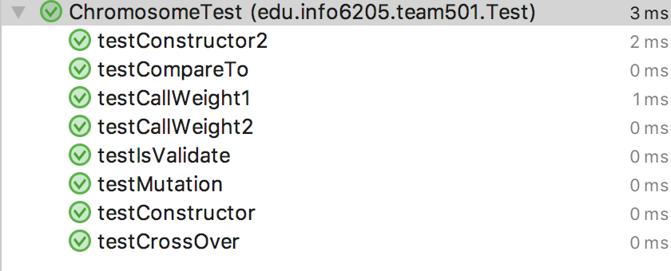
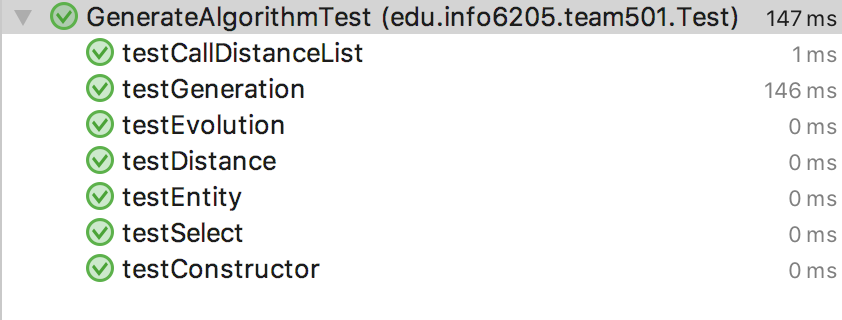

# The topic of our project: TSP (Travelling salesman problem)
> The travelling salesman problem (TSP) asks the following question: "Given a list of cities and the distances between each pair of cities, what is the shortest possible route that visits each city and returns to the origin city?" It is an NP-hard problem in combinatorial optimization, important in operations research and theoretical computer science.

Reference: [TSP in Wikipedia](https://en.wikipedia.org/wiki/Travelling_salesman_problem)

## Team Details
- Team number: team501
- Ang Li (NUID:001820694)
- Xiaohan Zhao (NUID:001825212)

## What We Did:
- Created a genetic algorithm to solve the travelling salesman problem with clearly comments
- Used parallel computation mechanism to divide population up into sub-populations and merge the next generations for each colony in parallel
- Created unit tests to test most of the methods to keep the project operating properly
- Created several input data files to be used in this algorithm
- Created a user interface using Panel to show the progress of the evolution

## Class Diagram
- TSPChromosome
  - 
- TSPGeneticAlgorithm
  - 

## Design of TSPChromosome
- genotypeList and phenotypeList
  - GenotypeList is used to represent the genotype of the corresponding chromosome
  - PhenotypeList is used to represent the real path
  - We used DNF type (A, C, G, T) as the genotype
  - The genotypeList and the phenotypeList can be transformed to each other by calling genoToPheno() or phenoTogeno() methods
  ```
  As an example, a chromosome has the following genotypeList and phenotypeList:
  GenotypeList: [AGAT, AGAA, AGAG, AGAC, AAGG, AATT, AACG, AAGC, AAGA, AAAT, AACC, AAAC, AAGT, AACA, AATC, AATG, AATA, AAAG, AACT, AAAA]
  PhenotypeList: [19, 16, 17, 18, 5, 15, 9, 6, 4, 3, 10, 2, 7, 8, 14, 13, 12, 1, 11, 0]
  ```
- weight
  - The weight data is used to calculate the total distance of the chromosome based on the path and the weight map calculated from the given data file

- crossover(TSPChromosome that)
  - This method is used to generate new chromosome objects, The key code is shown as following:
  ```
  public TSPChromosome crossOver(TSPChromosome that) {
		int[] newPhenotypeList = new int[chromosomeLength];
		String[] newGenotypeList = new String[chromosomeLength];
		// Random location from 1 to chromosome length - 1
		int randomLocation = Math.abs(random.nextInt() % (chromosomeLength - 1)) + 1;

		// The start (from random location to end) gene list are from this
		for (int i = 0, j = randomLocation; j < chromosomeLength; i++, j++)
			newGenotypeList[i] = genotypeList[j];

		// The other gene list are from that and the repeated genes are removed
		for (int i = chromosomeLength - randomLocation, j = 0; i < chromosomeLength;) {
			newGenotypeList[i] = that.genotypeList[j++];
			int k;
			for (k = 0; k < chromosomeLength - randomLocation; k++)
				if (newGenotypeList[k].equals(newGenotypeList[i]))
					break;
			if (k == chromosomeLength - randomLocation)
				i++;
		}
  ```
  - In this method, a chromosome crossover with another chromosome by using the genotype. At first, we generate a random number, and the new chromosome is generated by part of the father chromosome and part of the mother chromosome. To prevent visiting a city repeatedly, we need to ignore the used genes.
- mutation()
  - This method is used to mutate the chromosome, the key code is shown as following:
  ```
  public void mutation() {
		int randomLocation1, randomLocataion2;
		String temp;

		// Generate two different gene
		randomLocation1 = Math.abs(random.nextInt() % chromosomeLength);
		randomLocataion2 = Math.abs(random.nextInt() % chromosomeLength);
		while (randomLocation1 == randomLocataion2)
			randomLocataion2 = Math.abs(random.nextInt() % chromosomeLength);

		// Exchange the gene located in the random locations
		temp = genotypeList[randomLocation1];
		genotypeList[randomLocation1] = genotypeList[randomLocataion2];
		genotypeList[randomLocataion2] = temp;
		for (int i = 0; i < chromosomeLength; i++)
			phenotypeList[i] = genotypeToPhenotype(genotypeList[i]);
	}
  ```
  - The key idea is generating two different cities randomly and swap them
- isValidateChromosome()
  - This method is used to debug and test to gerantee all of the chromosome lists are validated.
- compareTo(TSPChromosome that)
  - We overrided the compareTo method in order to sort the chromosome in generation algorithm

## Design of TSPGeneticAlgorithm
- Default parameters
  - There are some default parameters. If user call the constructor only with a data file, the other parameters will be as default. And users can also set some parameters by calling some constructors with parameters.
  ```
  private final static double P_DEFAULT_CROSS = 0.9;
  private final static double P_DEFALUT_MUTATION = 0.1;
  private final static int GENERATION_NUM = 100;
  private final static int DEFAULT_POPULATION_NUM = 30000;
  ```
  - P_DEFAULT_CROSS: The possibility of cross over happens
  - P_DEFAULT_MUTATION: The possibility of mutation happens
  - GENERATION_NUM: Max generation number
  - DEFAULT_POPULATION_NUM: The population number of each generation
- initDataFromTxtFile(String filename)
  - This is used to initialize the whole generation algorithm because all the data are got from external txt file
- calFitnessList()
  - This is used to calculate the list of fitness of the given generation, the key code is as following:
  ```
  public void calFitnessList() {
		double sumFitness = 0;
		for (int i = 0; i < populationNum; i++) {
			fitnessList[i] = (double) 1 / distanceList[i];
			sumFitness += fitnessList[i];
		}
		fitnessList[0] = fitnessList[0] / sumFitness;
		for (int i = 1; i < populationNum; i++)
			fitnessList[i] = fitnessList[i - 1] + fitnessList[i] / sumFitness;
	}
  ```
  - We used 1/weight to calculate the fitness, and the fitness of chromosome are divided by the sum of fitness of all the population
- select()
  - This method is used to choose good entities to generate a child generation and cull the bad entities
  - The chromosomes are sorted by the weight to be chosen properly
  - The best entity of each generation will keep alive without any change to keep the best genotype of old generation
- evolution()
  - This method is used to crossover and mutation of the new generation's genotype
  - In our algorithm, the possibility of crossover is much higher than the possibility of mutation, this is a experiment conclusion
- bestEntity()
  - This method is used to calculate the best entity of each generation
- generate()
  - This method is used to call the calFitnessList(), select(), evolution(), bestEntity() and some other methods in the properly order
  - This is used to print some information of each generation and the best entity
  - The default generation number is GENERATION_NUM

## Parallel Computation Mechanism
- We used parallel computation mechanism to divide population up into sub-populations and merge the next generations for each colony in parallel
- java.util.concurrent.CompletableFuture
  - We used the CompletableFuture class in the concurrent package to do the parallel computation
  - The key code is shown as following:
  ```
	CompletableFuture<TSPChromosome[]> parGenerate = parGenerate1.thenCombine(parGenerate2, (xs1, xs2) -> {
		TSPChromosome[] result = new TSPChromosome[length];
		for (int i = 0; i < mid; i++)
			result[i] = xs1[i];
		for (int i = mid; i < length; i++)
			result[i] = xs2[i - mid];
		return result;
	});
  ```
  ```
	parGenerate.whenComplete((result, throwable) -> {
		if (throwable != null) {
			parGenerate.completeExceptionally(throwable);
		} else {
			for (int i = 0; i < result.length; i++) {
				childChromosomeList[i] = result[i];
			}
		}
	});
  ```
  - See the detail code in the .java file
  ```
	private CompletableFuture<TSPChromosome[]> parGenerate(TSPChromosome[] generatingList, int from, int to) {
		return CompletableFuture.supplyAsync(() -> {
      //select
      //crossOver
      //mutation
      //return
		});
	}
  ```
- We divided population into two sub-populations and generate each sub-population in thread separately, and after we complete generate all the sub-populations, we will merge the best entities of each sub-population together as the new generation and copy the result to the new chromosome list.

## Unit tests
- ChromosomeTest
  - 
- GenerateAlgorithmTest
  - 

## Input and output files
- Input files, click [Input Files](https://github.com/Leon-Hhhhhhanne/TSPGenerateAlgorithm/tree/master/input)
- Output files, click [Output Files](https://github.com/Leon-Hhhhhhanne/TSPGenerateAlgorithm/tree/master/output)

## User Interface (Output)
- We created an user interface which users can upload file and run the generation algorithm.
- At first, the user interface is as following, and user can upload a data file to it, the screenshot is as following:
  - 
- After uploaded a data file, user can see the parameters including shortest distance, the best genotype and phenotype from the UI, the screenshot is as following (the conclusion is obtained by data.txt)
  - 
- Another output (the conclusion is obtained by data.txt)
  - 
